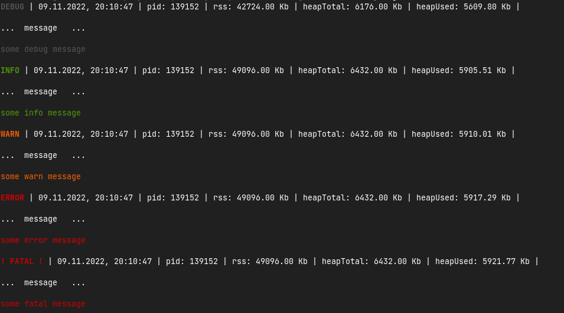
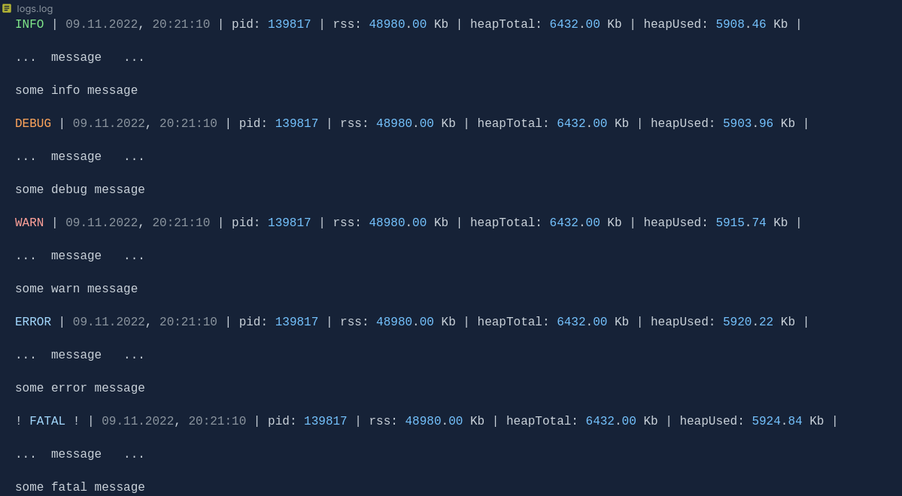
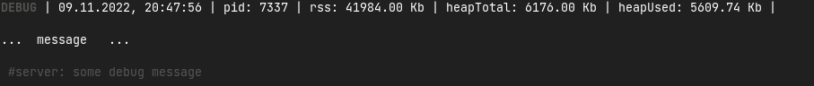
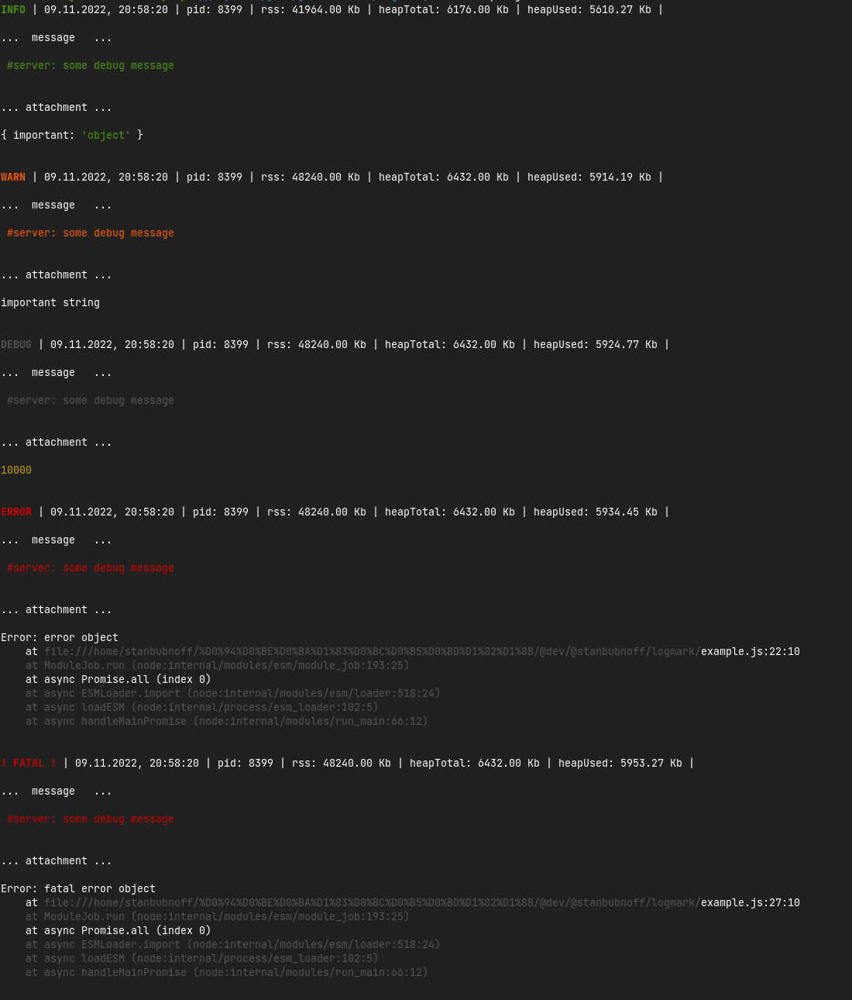
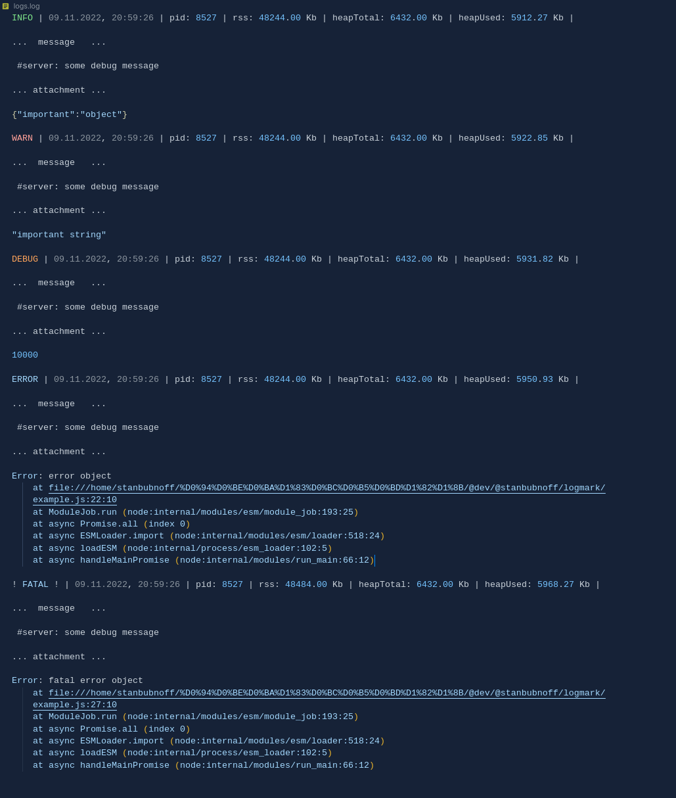

# Simple, lightweight and dependency free nodejs logger with human-readable logs
> !!! IT'S VERY VERY VERY IMPORTANT !!!  
> Please set star for this repo on github :) :) :)  
> It's very simple but will cheer up the author  
> Thanks! :)
## Why?
I needed a very simple logger without third-party dependencies, a complex configuration and with a beautiful human-readable output. 

I didn't find it. So, i'm wrote it.
## Quick start
Logmark support five levels of logs:

- debug
- info
- warn
- error
- fatal

By default Logmark generate new 'logs' folder in your project root and all logs writes to a single 'logs.log' file

Let's look at the code below:
```javascript
import { Logmark } from 'logmark'

const mark = new Logmark()

mark.debug('some debug message')
mark.info('some info message')
mark.warn('some warn message')
mark.error('some error message')
mark.fatal('some fatal message')
```
Now we can see next terminal output:   



As you can see, Logmark adds local time, pid and memory usage information to each message.  

I think the memory usage information is very important and seeing its logs is very convenient for tracking memory leaks. It may also make it clear at an early stage that refactoring of some functions is necessary.

Logmark has already created the logs folder and added the logs.log file to it.
Let's look at the file output:



Well, in many cases this is enough for basic use, but you can add a few settings to distribute logs to different files, and you can also attach additional information to messages.
## Usage
### Config
Let's look how you can set your custom name logs folder and file and distribute logs to different files.

```javascript
import { Logmark } from 'logmark'

const mark = new Logmark({
  files: {
    enabled: true, // set the value to false to disable logging to files
    pathname: 'custom logs path',
    filename: 'custom logs file'
  }
})
```
You can also assign a file name for each log level and group logs in any way.

```javascript
import { Logmark } from 'logmark'

const mark = new Logmark({
  files: {
    enabled: true,
    pathname: 'custom logs path',
    // filename: 'custom logs file'
    filenames: {
      debug: 'डिबग',
      info: '资料',
      warn: 'atención',
      error: 'errors',
      fatal: 'errors'
    }
  }
})
```
### Add tag
You can set a tag to identify the initiator of the message.
```javascript
import { Logmark } from 'logmark'

const mark = new Logmark()

mark.debug('some debug message', {
  tag: 'server'
})
```
Console output:


### Add attachment
You can add an any data or error object to your log message

```javascript
import { Logmark } from 'logmark'

const mark = new Logmark()

mark.info('some debug message', {
  tag: 'server',
  data: { important: 'object' }
})

mark.warn('some debug message', {
  tag: 'server',
  data: 'important string'
})

mark.debug('some debug message', {
  tag: 'server',
  data: 10000
})

mark.error('some debug message', {
  tag: 'server',
  error: new Error('error object')
})

mark.fatal('some debug message', {
  tag: 'server',
  error: new Error('fatal error object')
})
```
Console output:



File output:



## Roadmap
I'm thinking about developing the library without much damage to its simplicity and minimalism. If there are suggestions, then forks and pull request are welcome!

If you would like to see some functionality, you can open issue

I plan to add functionality for daily file rotation in the near future.
## Contributing
Use StandardJS style and SonarLint and welcome! 
## Support project
If you want to support the project with a small donation for my small contribution to open source, I will be very very happy!)

BTC: bc1q4my5g4jf9cy0gzqams9mp06kmyuj59qgpwmrh6  
ETH: 0x2C4e8803ecF2E44D55aF615dF8476C786B5b764a  
USDT: 0x2C4e8803ecF2E44D55aF615dF8476C786B5b764a  
USDC: 0x2C4e8803ecF2E44D55aF615dF8476C786B5b764a 

Also a simple support will be a simple star on github :)

Thanks!
